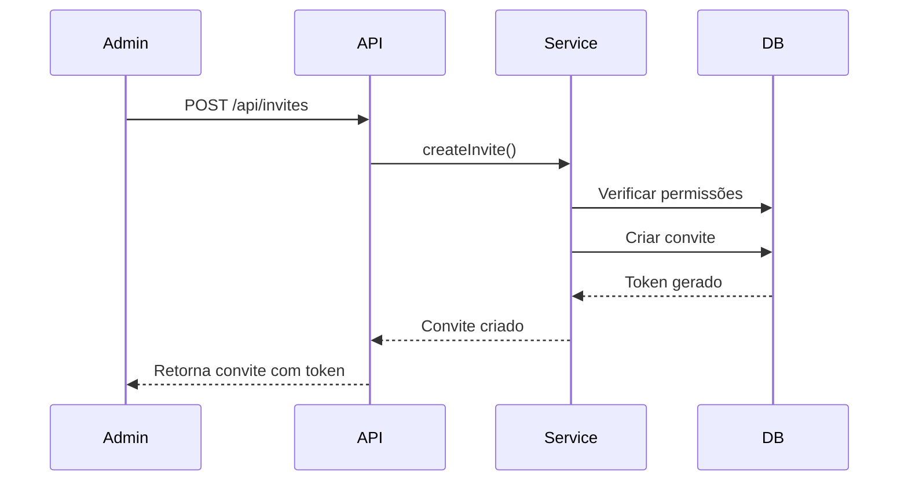
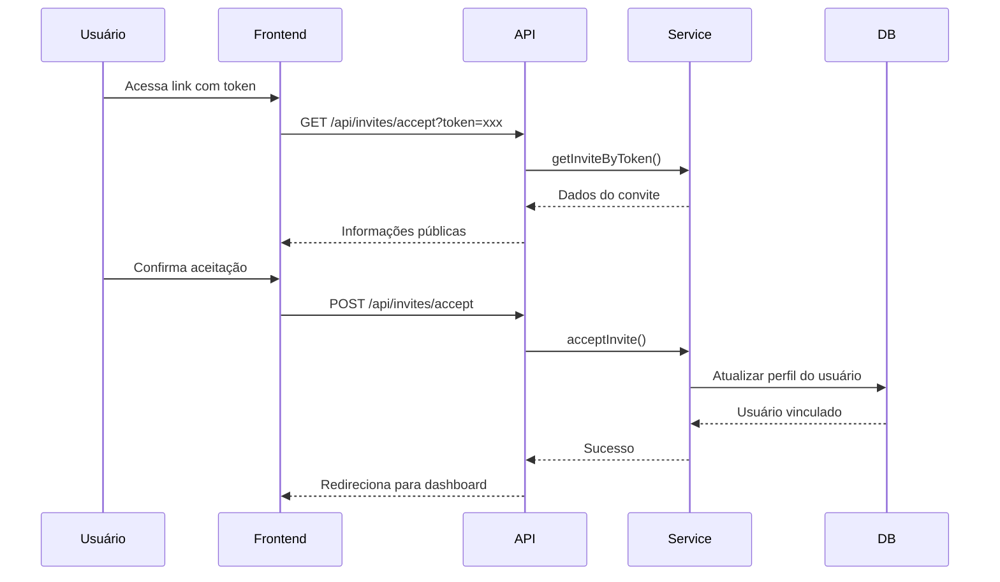

# Sistema de Onboarding - ProviDATA

## 📋 Visão Geral

Sistema completo de gerenciamento de convites e onboarding de usuários para o ProviDATA, com suporte a multitenancy e controle de acesso baseado em organizações.

## 🏗️ Arquitetura

### 1. Banco de Dados

#### Tabelas Criadas

- **`invites`**: Armazena os convites enviados
  - `id`: UUID único do convite
  - `email`: Email do convidado
  - `token`: Token único para aceitar o convite (gerado automaticamente)
  - `role`: Papel do usuário (admin, gestor, operador, visualizador)
  - `organization_id`: Organização para qual o usuário está sendo convidado
  - `invited_by`: ID do usuário que criou o convite
  - `status`: Status do convite (pending, accepted, expired, revoked)
  - `expires_at`: Data de expiração do convite
  - `accepted_at`: Data em que o convite foi aceito
  - `metadata`: Dados adicionais em formato JSON

#### Funções SQL

- **`accept_invite(invite_token, user_id)`**: Aceita um convite e vincula o usuário à organização
- **`expire_old_invites()`**: Expira convites antigos automaticamente

### 2. Serviço de Onboarding

**Arquivo**: `src/lib/services/onboarding.service.ts`

#### Métodos Principais

##### `createInvite(request, invitedBy)`
Cria um novo convite para um usuário.
- Verifica se o usuário que convida é admin ou super admin
- Valida se já existe convite pendente para o email
- Super admin pode convidar para qualquer organização
- Admins normais só podem convidar para sua própria organização

##### `listInvites(organizationId, userId)`
Lista todos os convites de uma organização.
- Super admin pode listar convites de qualquer organização
- Admins normais só podem listar convites da sua organização

##### `getInviteByToken(token)`
Busca um convite pelo token (público).
- Verifica se o convite está pendente
- Verifica se o convite não expirou

##### `acceptInvite(token, userId)`
Aceita um convite e vincula o usuário à organização.
- Usa a função SQL `accept_invite` para garantir atomicidade
- Atualiza o perfil do usuário com a organização e role

##### `revokeInvite(inviteId, userId)`
Revoga um convite pendente.
- Super admin pode revogar qualquer convite
- Admins normais só podem revogar convites da sua organização

##### `resendInvite(inviteId, userId)`
Reenvia um convite (estende a validade).
- Super admin pode reenviar qualquer convite
- Admins normais só podem reenviar convites da sua organização

### 3. API Routes

#### `GET /api/invites`
Lista convites da organização do usuário autenticado.
- Requer autenticação
- Requer role de admin ou super admin

#### `POST /api/invites`
Cria um novo convite.
- Requer autenticação
- Requer role de admin ou super admin
- Valida email e role
- Super admin deve especificar `organization_id`

**Body**:
```json
{
  "email": "usuario@exemplo.com",
  "role": "gestor",
  "organization_id": "uuid-da-organizacao", // Opcional para admins, obrigatório para super admin
  "expires_in_days": 7, // Opcional, padrão 7 dias
  "metadata": {} // Opcional
}
```

#### `GET /api/invites/accept?token=xxx`
Busca informações públicas de um convite.
- Não requer autenticação
- Retorna dados básicos do convite e organização

#### `POST /api/invites/accept`
Aceita um convite.
- Requer autenticação
- Vincula o usuário à organização

**Body**:
```json
{
  "token": "token-do-convite"
}
```

#### `PATCH /api/invites/[id]`
Atualiza um convite (reenviar ou revogar).
- Requer autenticação
- Requer role de admin ou super admin

**Body**:
```json
{
  "action": "resend" // ou "revoke"
}
```

## 👤 Super Admin

### Configuração

**Email**: `contato@dataro-it.com.br`  
**Senha**: `@D4taR1x`  
**Organização**: DATA-RO (estadual)

### Permissões Especiais

O super admin tem permissões especiais em todo o sistema:

1. **Criar Convites**: Pode convidar usuários para qualquer organização
2. **Listar Convites**: Pode ver convites de todas as organizações
3. **Revogar Convites**: Pode revogar convites de qualquer organização
4. **Reenviar Convites**: Pode reenviar convites de qualquer organização

### Organização DATA-RO

A organização DATA-RO foi criada especialmente para ser a administradora geral do sistema:

- **Nome**: DATA-RO
- **Slug**: dataro
- **Tipo**: estadual
- **Configurações especiais**:
  - `is_super_admin_org`: true
  - `can_access_all_organizations`: true
  - Descrição: "Organização administradora geral do sistema ProviDATA"

## 🔐 Controle de Acesso

### Roles Disponíveis

1. **admin**: Administrador da organização
   - Pode criar, listar, revogar e reenviar convites
   - Pode gerenciar usuários da organização
   - Acesso total aos recursos da organização

2. **gestor**: Gestor de equipe
   - Pode gerenciar providências
   - Pode visualizar relatórios
   - Acesso limitado a recursos da organização

3. **operador**: Operador do sistema
   - Pode criar e editar providências
   - Pode visualizar cidadãos
   - Acesso básico aos recursos

4. **visualizador**: Apenas visualização
   - Pode visualizar providências e relatórios
   - Não pode editar ou criar recursos

### Hierarquia de Permissões

```
Super Admin (contato@dataro-it.com.br)
  └── Acesso a todas as organizações
      └── Organização DATA-RO
      └── Organização Gabinete A
      └── Organização Gabinete B
      └── ...

Admin de Organização
  └── Acesso apenas à sua organização
      └── Pode convidar usuários
      └── Pode gerenciar equipe
```

## 📝 Fluxo de Onboarding

### 1. Criação do Convite



### 2. Aceitação do Convite



## 🚀 Migrations

### Ordem de Execução

1. **`20231231_onboarding_system.sql`**: Cria tabelas e funções do sistema de onboarding
2. **`20231231_create_super_admin.sql`**: Cria o usuário super admin
3. **`20240101_create_dataro_organization.sql`**: Cria a organização DATA-RO e vincula o super admin

### Como Executar

```bash
# No Supabase Dashboard, vá em SQL Editor e execute as migrations na ordem acima
```

## 🎨 Componentes Frontend

### Páginas

- **`/admin/convites`**: Gerenciamento de convites (lista, criar, revogar)
- **`/convite/[token]`**: Página pública para aceitar convite

### Componentes (a serem criados)

- `InviteList`: Lista de convites com ações
- `InviteForm`: Formulário para criar convite
- `InviteAccept`: Página de aceitação de convite

## 📊 Tipos TypeScript

**Arquivo**: `src/types/onboarding.ts`

```typescript
interface Invite {
  id: string;
  email: string;
  token: string;
  role: 'admin' | 'gestor' | 'operador' | 'visualizador';
  organization_id: string;
  invited_by: string;
  status: 'pending' | 'accepted' | 'expired' | 'revoked';
  expires_at: string;
  accepted_at?: string;
  metadata?: Record<string, any>;
  organization?: Organization;
  inviter?: Profile;
}
```

## 🔧 Configuração

### Variáveis de Ambiente

```env
NEXT_PUBLIC_SUPABASE_URL=sua-url-supabase
NEXT_PUBLIC_SUPABASE_ANON_KEY=sua-chave-anonima
SUPABASE_SERVICE_ROLE_KEY=sua-chave-service-role
```

## 📚 Exemplos de Uso

### Criar Convite (Admin Normal)

```typescript
const response = await fetch('/api/invites', {
  method: 'POST',
  headers: { 'Content-Type': 'application/json' },
  body: JSON.stringify({
    email: 'novo@usuario.com',
    role: 'gestor',
    expires_in_days: 7
  })
});
```

### Criar Convite (Super Admin)

```typescript
const response = await fetch('/api/invites', {
  method: 'POST',
  headers: { 'Content-Type': 'application/json' },
  body: JSON.stringify({
    email: 'novo@usuario.com',
    role: 'admin',
    organization_id: 'uuid-da-organizacao',
    expires_in_days: 7
  })
});
```

### Aceitar Convite

```typescript
const response = await fetch('/api/invites/accept', {
  method: 'POST',
  headers: { 'Content-Type': 'application/json' },
  body: JSON.stringify({
    token: 'token-do-convite'
  })
});
```

## 🎯 Próximos Passos

1. ✅ Criar serviço de onboarding
2. ✅ Criar API routes
3. ✅ Configurar super admin
4. ✅ Criar organização DATA-RO
5. ⏳ Implementar componentes frontend
6. ⏳ Adicionar envio de emails
7. ⏳ Implementar notificações
8. ⏳ Adicionar testes

## 📞 Suporte

Para dúvidas ou problemas, entre em contato com a equipe DATA-RO através do email: contato@dataro-it.com.br
